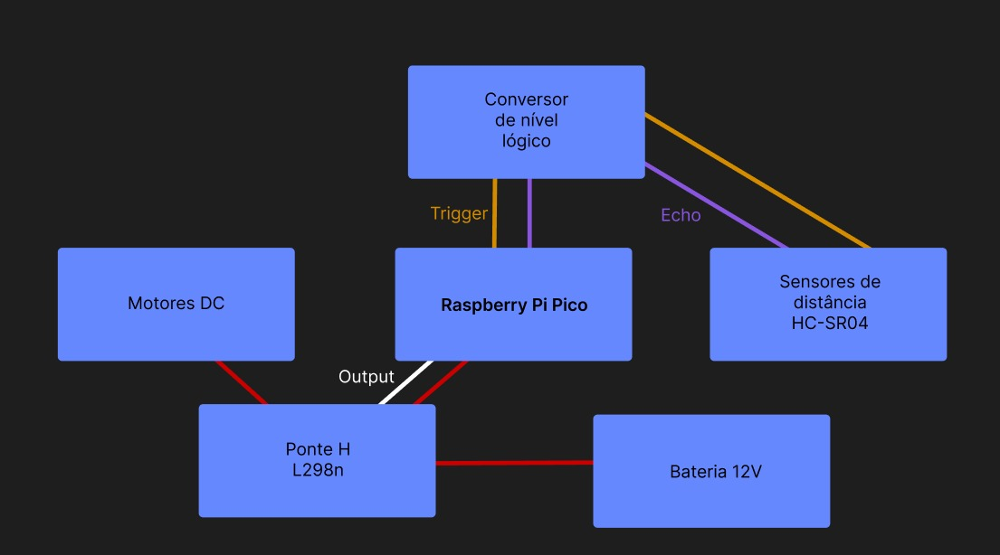

# `Pyrobot`

# 🐊 Projeto de microcontroladores e sistemas embarcados

### Integrantes

- [Luis Guilherme de Souza Munhoz](https://github.com/luisgmunhoz) `20.01937-8`

- [Guilherme Guerra](https://github.com/GuilhermeVoyna) `20.00089-8`

- [Enrico Giannobile](https://github.com/EnricoGia) `19.00610-0`

- [Ettore Padula Dalben](https://github.com/EttoreK) `20.00387-0`

# 😶‍🌫️ Descrição

### O Pyrobot é um robô compacto que combina o Raspberry Pi Pico e componentes eletrônicos adicionais para criar um robô que se move evitando obstáculos em seu caminho de forma reativa 
<br/>

# 🤖 Componentes


- Raspberry Pi Pico

- Sensor de distância ultrassônico HC-SR04

- 2 Motores DC

- 2 Correias

- Carcaça de tanque Robocore

- Placa de circuito impressa

- Ponte H L298N

- 3 Pilhas de 3.7V e Suporte para pilhas

- Jumpers

- Conversor de nível lógico

- 2 cabos jacaré x jacaré

<br/>

# ⚙️ Configuração

1. Conecte o Raspberry Pi Pico ao seu computador usando o cabo micro USB.

2. No seu computador, abra o editor de texto ou a IDE de sua escolha.

3. Baixe e instale a biblioteca rpi_pico para programar o Pico. Essa biblioteca pode ser encontrada no seguinte repositório: https://github.com/raspberrypi/pico-sdk.

4. Clone este repositório para o seu computador:

``` bash
git clone https://github.com/luisgmunhoz/Pyrobot.git
```

5. Acesse o diretório do projeto:

```bash
cd Pyrobot
```
<br/>

# 🛹 Uso
O Pyrobot é programado em MicroPython, uma versão leve da linguagem de programação Python. Dentro do diretório do projeto, você encontrará diversos exemplos de código que podem ser utilizados como ponto de partida para desenvolver suas próprias funcionalidades.

1. Abra o arquivo main.py em seu editor de texto ou IDE.

2. Explore o código existente para entender como o Pyrobot funciona.

3. Faça as alterações desejadas ou adicione novas funcionalidades ao código.

4. Conecte o Raspberry Pi Pico ao seu computador e transfira o código para o Pico.

5. Desconecte o Pico do computador e alimente-o com uma fonte de energia externa 12V(como uma bateria).Observe o comportamento do Pyrobot conforme o código é executado.

# 🔎 Log de distancia

O Pyrobot possui a capacidade de medir a distância utilizando um sensor ultrassônico. Além disso, ele é capaz de armazenar essas medições em um log para análise posterior. O log de distância é um arquivo de texto onde cada linha representa uma medição de distância.

Para utilizar o log de distância, siga as instruções abaixo:

1. Conecte o Raspberry Pi Pico ao seu computador via USB.

2. Abra o explorador de arquivos da Pi Pico

3. Procure pelo dispositivo do Raspberry Pi Pico na lista de dispositivos conectados.

4. Abra o dispositivo e procure pelo arquivo "***logs.txt***".

5. Abra o arquivo para visualizar as medições de distância registradas.

A distância medida pelo sensor sonar no formato fornecido é em centímetros (cm). Cada linha representa uma medição de distância em cm. Exemplo do arquivo medidor ***logs.txt***

```
disfrância em cm: 98.28665
disfrância em cm: 27.4743
disfrância em cm: 79.4731
disfrância em cm: 79.7818
disfrância em cm: 101.528
disfrância em cm: 87.85945
disfrância em cm: 96.70885
```
<br/>

Caso o houver algum erro de instalação ou o sensor estiver queimado o arquivo  ***logs.txt*** ira estar parecido com o exemplo abaixo

<br/>

```
disfrância em cm: 0
disfrância em cm: 0
disfrância em cm: 0
disfrância em cm: 0
disfrância em cm: 0
disfrância em cm: 0
disfrância em cm: 0
```
<br/>
Neste caso verifique os seus cabos as suas conexões  e o estado do sensor.

# 🛠️ Montagem

Siga os passos abaixo para montar o Pyrobot:

1. Conecte o Raspberry Pi Pico à placa de circuito.

2. Instale a ponte H na carcaça do pyrobot
    - Conecte a entrada GND da ponte H ao GND do pyrobot
    - Conecte a entrada 12+ o Vcc de uma fonte 12 V
    - Conecte a saída +5V 

2. Conecte o sensor de distância ultrassônico HC-SR04 (ou equivalente) 
    - Porta `1` deve ser colocado o `TRIGGER`
    - Porta `3` deve ser conectada ao `ECHO`
    - Conecte o Vcc em na saída 5v


4. Conecte os 2 motores DC à ponte H L298N, seguindo as instruções do fabricante.
    1. MOTOR DIREITO
    - Conecte o fio preto no out1
    - Conecte o fio vermelho no out2
    2. MOTOR ESQUERDO
    - Conecte o fio preto no out4
    - Conecte o fio vermelho no out3

5. Fixe a carcaça de tanque Robocore aos motores DC.

6. Conecte as correias aos eixos dos motores DC e ao chassi do Robocore.

7. Conecte o conversor de nível lógico entre o Raspberry Pi Pico e a ponte H L298N, seguindo as instruções do fabricante.

8. Conecte as 3 pilhas de 3.7V ao suporte de pilhas e conecte o suporte de pilhas à ponte H L298N.

9. Conecte os jumpers entre os pinos do Raspberry Pi Pico, sensor ultrassônico, ponte H L298N e conversor de nível lógico, seguindo o esquema de conexões do projeto.

10. Verifique se todas as conexões estão seguras e corretas.

11. O Pyrobo está pronto para ser utilizado!

- Caso tenha alguma duvida siga o diagrama de blocos de sistema abaixo

# 🔩 Diagrama de Blocos de Sistema 

